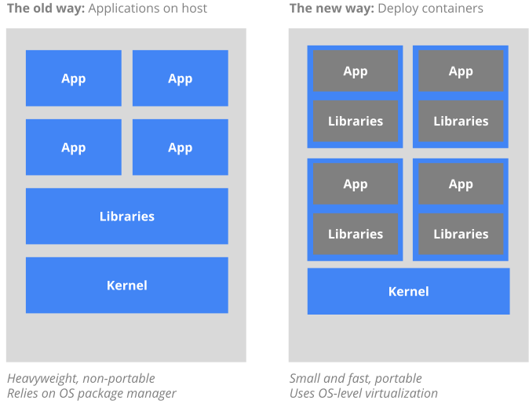
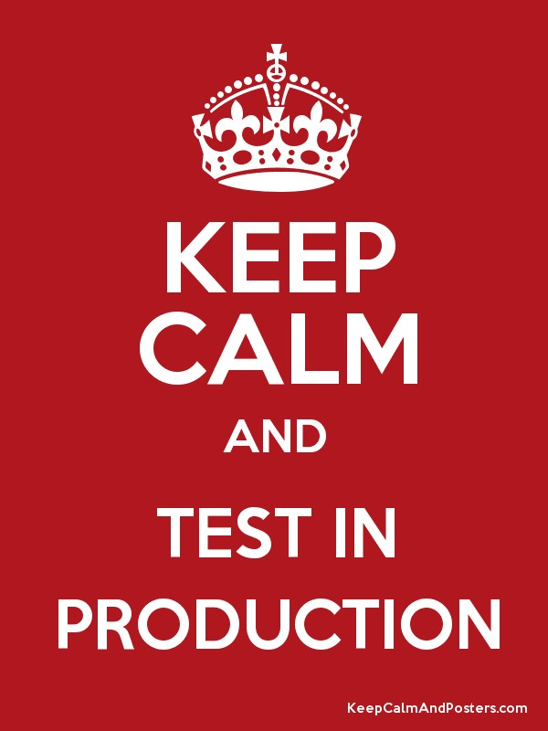

---

## What is Kubernetes?

A platform for managing containerized workloads and services

- A container platform 
- A microservice platform 
- A portable cloud platform 

---

## What are containers?

---

## What Kubernetes is not

- Doesn't limit types of applications
- Isn't  CI / CD
- Doesn't dictate developer workflow
- Doesn't provide application level services although it allows these to be plugged in
- Doesn't, for instance, dictate logging / monitoring 

---

## What issues do we hope to address with K8s?

---

## An incremental migration to the public cloud

- Kubernetes is offered as a service by the 3 major cloud providers
- Clusters *could be* federated

---

## High Cost / Slow Access For Experiments

---

## Fragile Deployment Pipeline

- Environments are not like for like. 
- All services dependencies are installed on a single machine. No isolation 

---

## Fragile System Runtime

- With many services on the same machines:
    - Bad service instances are not individually detectable
    - Ops have limited visibility of individual service resource utilization.
    - Cascading failures 
    - No centralized monitoring

---

## Poor Resource Utilisation

- Our resource usage varies over time but we reserve resource for a functions peak usage. No ability to 'burst in / to the cloud'.

---

## Poor Visibility Of Costs

- The ongoing costs of applications / features are nearly impossible to calculate as we can't measure their resource usage.

---

## Dark Configuration 

- Configuration in our environments is not backed up and / or is not in source control.

- Examples, there are many more:
    - Jetnexus configuration
    - machine.config
    - Network switch config
    - DNS server config
    - Octopus configuration

---

## Infrastructure Mutation

- Mutating infrastructure leaves it in an unknown state. Changes cannot be tested consistently or repeatably.

---

## Poor Separation Of Responsibilities Between Ops And Devs

- Ops spend a lot of time building boxes to suit devs. Devs are better placed to understand application dependencies.
- Ops control network configuration but, again, devs are better placed to understand application usage.
- Changes required for applications are done by ops outside the release cycle.

---

## Poor Security

- Abundant access to production required to mutate servers
- Poor auditing
- Poor accountability

---

## Poor Accountability / Auditing

- We don't know who made a change
- We don't know when changes were made

---

## (Re-)inventing The Wheel

- A (good) abstraction over the infrastructure allows solutions to be developed at the infrastructure level.

- In it's absence we end up (re-)inventing the wheel in our application layer.

- Some examples:
    - Monitoring and alerting, currently we are unable to see resource usage by application
    - Distributed tracing
    - Service discovery
    - Load balancing, currently a bad service is not removed from the pool as all services are in that pool

---

## Currently used in production!

---

## Any questions?

- Any further presentations?
